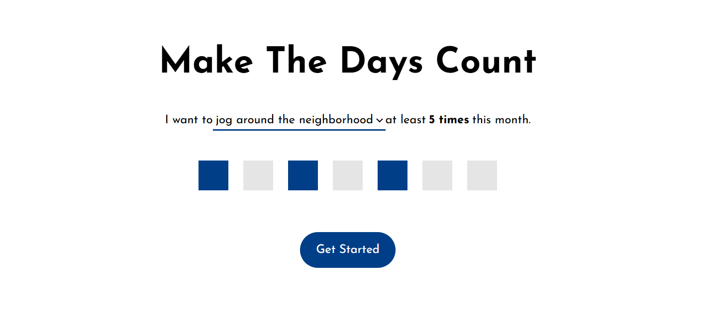

  

<h1 align="center">What did I do this month?</h1>

# Introduction

I am guilty of juggling too many balls at one time. The challenge isn't the juggling, it's actually realizing that a ball fell. So I decided to build WDIDTM, to keep a bird's eye view of how many times I've shown up for the activities that are most important. 

WDIDTM focuses on long term commitment over daily streaks. Streaks are great for building momentum and using the original motivation in order to get off to a good start. However, they put too much pressure to meet unrealistic standards. 

On the other hand, it is incredible how quietly months can pass by without noticing you haven't made progress towards your goals.

The hope is by maintaining a snapshot of where you are each month, you can recommit to your long term vision.